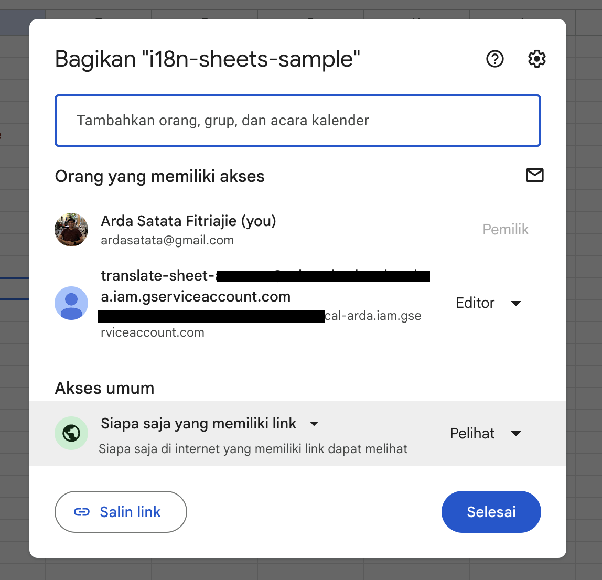

# i18n-google-sheets
i18n json managed with google spreadsheets

Sample sheets [link](https://docs.google.com/spreadsheets/d/1FMLCsDFYrC9FIV0xcOgb-6eafVYr-R77ziL5F1v9WcU/edit?gid=247846459#gid=247846459)

### How to use

1. Duplicate i18n sheets
2. create service account, named as service-account.json then put it on root ([tutorial](https://cloud.google.com/iam/docs/service-accounts-create))
3. Invite service account email as `Editor` / `Viewer` to the sheets


```
node cli.js -i <your-spreadsheet-id> -s ./service-account.json -o ./translations -l en jp
```
4. Run ` node cli.js -i 1FMLCsDFYrC9FIV0xcOgb-6eafVYr-R77ziL5F1v9WcU -s ./service-account.json -o ./results -l en jp`

### Library used

- google-auth-library
- google-spreadsheet

Mainly inspired from [this](https://medium.com/js-dojo/manage-i18n-translations-from-google-sheet-e2ccc340aa3)